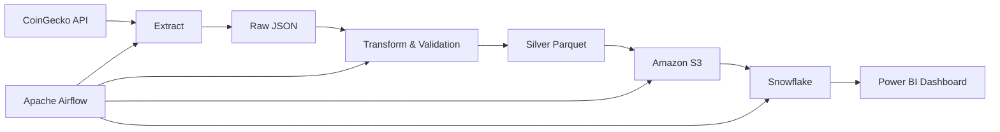

<div align="center">

# 🚀 Crypto Market ETL Pipeline
An end-to-end cloud-based Data Engineering project that ingests live cryptocurrency market data from the CoinGecko API, transforms it into analytics-ready datasets, stores it in Amazon S3, loads it into Snowflake, and orchestrates the entire workflow using Apache Airflow.

This project is being built as part of the **WesOnline Data Engineering Mentorship Program** to demonstrate modern data engineering practices and production-ready ETL pipeline development.

Build Status • In Progress


Extract • Validate • Transform • Load • Orchestrate • Analyze

</div>

---

## 📌 Project Progress

| Stage | Status |
|-------|--------|
| ✅ Stage 1 – Data Extraction & Transformation | Completed |
| ✅ Stage 2 – Cloud Integration (AWS S3, Snowflake & Airflow) | Completed |
| ✅ Stage 3 – Gold Layer & Analytics | Completed |
| ⏳ Stage 4 – Power BI Dashboard | In Progress |
| ⏳ Stage 5 – Incremental ETL, Monitoring & Production Improvements | Planned |

---

# 📖 Overview

The **Crypto Market ETL Pipeline** is a production-inspired Data Engineering project that automates the ingestion, transformation, validation, storage, and orchestration of live cryptocurrency market data.

The pipeline retrieves real-time market data from the CoinGecko API, validates and transforms it into analytics-ready Parquet datasets, stores it in Amazon S3, and prepares it for downstream analytics in Snowflake and Power BI.

The project demonstrates modern cloud data engineering practices including:

- REST API ingestion
- Data validation
- Schema enforcement
- Metadata management
- Hive-style partitioning
- Cloud Data Lake architecture
- Workflow orchestration
- Data warehousing
- Business Intelligence

---

# 🎯 Objectives

The primary objectives of this project are to:

- Build an end-to-end ETL pipeline
- Demonstrate production-ready Data Engineering practices
- Implement a Medallion Architecture
- Store data in a cloud data lake
- Orchestrate workflows using Apache Airflow
- Load curated datasets into Snowflake
- Develop an executive dashboard in Power BI

---

# 🏛 Solution Architecture



---

# 🏗 Medallion Architecture

```
                Bronze Layer

        Raw CoinGecko JSON Files

                    │

                    ▼

                Silver Layer

        Cleaned Parquet Dataset

                    │

                    ▼

                 Gold Layer

      Snowflake Analytical Tables

                    │

                    ▼

          Power BI Dashboard
```

---

# ⚙ Tech Stack

| Category | Technology |
|-----------|------------|
| Programming | Python |
| Data Processing | Pandas |
| API | CoinGecko API |
| Workflow Orchestration | Apache Airflow |
| Containerization | Docker |
| Cloud Storage | Amazon S3 |
| Data Warehouse | Snowflake |
| BI Tool | Power BI |
| Database | PostgreSQL |
| Cloud SDK | boto3 |
| Configuration | python-dotenv |

---

# 📂 Project Structure

```text
crypto-market-etl-pipeline/

│

├── config/

├── dags/

├── data/

│ ├── raw/

│ ├── processed/

│ └── archive/

│

├── logs/

├── plugins/

├── scripts/

│ ├── extract.py

│ ├── transform.py

│ ├── load_to_s3.py

│ ├── validations.py

│ ├── utils.py

│ ├── io.py

│ └── logger.py

│

├── sql/

├── Dockerfile

├── docker-compose.yml

├── requirements.txt

├── .env

└── README.md
```

---

# 🔄 ETL Workflow

```text
CoinGecko API

        │

        ▼

Extract

        │

        ▼

Validate

        │

        ▼

Transform

        │

        ▼

Parquet

        │

        ▼

Amazon S3

        │

        ▼

Snowflake

        │

        ▼

Power BI
```

---

## ✨ Features

### Stage 1

- Extracts live cryptocurrency market data from the CoinGecko API
- Stores raw JSON data using Hive-style partitioning
- Data validation framework
- Schema enforcement
- Transformation into analytics-ready Parquet datasets
- Structured logging
- Modular ETL architecture

### Stage 2

- Uploads transformed Parquet files to Amazon S3
- Secure AWS authentication using IAM
- Snowflake cloud data warehouse integration
- External Stage configuration
- Automated data loading from S3 into Snowflake
- Apache Airflow workflow orchestration
- Dockerized Airflow environment
- End-to-end cloud ETL pipeline

---
## 📌 Roadmap

- [x] Extract cryptocurrency data
- [x] Transform and validate datasets
- [x] Generate Parquet files
- [x] Upload to Amazon S3
- [x] Integrate Snowflake
- [x] Build Airflow pipeline
- [x] Gold analytics layer
- [ ] Power BI dashboards
- [ ] Incremental ETL
- [ ] Monitoring & alerting

---

# 📊 Data Lake Structure

```text
data/

raw/

year=2026/

month=07/

day=12/

processed/

year=2026/

month=07/

day=23/

archive/
```

---

## 🧠 Key Concepts Demonstrated

- ETL Pipeline Design
- Data Validation
- Schema Enforcement
- Hive-style Partitioning
- Parquet Data Lake
- Cloud Storage (Amazon S3)
- Data Warehousing (Snowflake)
- Workflow Orchestration (Apache Airflow)
- Docker Containerization
- Modular Python Architecture
- Cloud Authentication with IAM

---

# 🚀 Quick Start

## Clone Repository

```bash
git clone https://github.com/Sanusi-Abdulmalik/crypto-market-etl-pipeline.git

cd crypto-market-etl-pipeline
```

---

## Create Virtual Environment

```bash
python -m venv .venv
```

Windows

```bash
.venv\Scripts\activate
```

Linux / macOS

```bash
source .venv/bin/activate
```

---

## Install Dependencies

```bash
pip install -r requirements.txt
```

---

## Configure AWS

```bash
aws configure
```

---

## Start Airflow

```bash
docker compose up -d --build
```

---

## Execute the Pipeline

Run Extraction

```bash
python -m scripts.extract
```

Run Transformation

```bash
python -m scripts.transform
```

Upload to Amazon S3

```bash
python -m scripts.load_to_s3
```

---

# 📈 Future Enhancements

- Snowflake COPY INTO pipeline
- Gold Layer transformation
- Power BI dashboard
- Data Quality Testing
- Great Expectations
- dbt integration
- CI/CD with GitHub Actions
- Terraform Infrastructure as Code
- Slack notifications
- AWS Secrets Manager

---

# 📸 Screenshots

The following screenshots will be added as the project progresses.

- Airflow DAG
- Amazon S3 Bucket
- Snowflake Tables
- Power BI Dashboard
- Pipeline Logs

---

# 💼 Skills Demonstrated

This project showcases practical experience in:

- Data Engineering
- ETL Pipeline Development
- Cloud Computing
- Amazon Web Services
- Apache Airflow
- Docker
- Python
- Pandas
- Snowflake
- Data Validation
- Metadata Management
- Data Lake Design
- Workflow Automation

---

# 🙏 Acknowledgements

This project is being developed as part of the **WesOnline Data Engineering Mentorship Program**, with a focus on building production-ready cloud data engineering solutions using modern industry tools and best practices.

---

# 👤 Author

**Abdulmalik Sanusi**

Data Engineer | Data Analyst

GitHub: https://github.com/Sanusi-Abdulmalik

LinkedIn: https://www.linkedin.com/in/abdulmalik-sanusi-b3a0813a3

---

<div align="center">

### ⭐ If you found this project useful, consider giving it a star!

</div>
