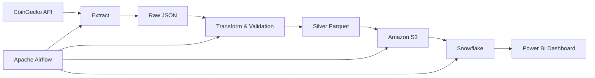

<div align="center">

# 🚀 Crypto Market ETL Pipeline

### Production-Ready Cloud Data Engineering Pipeline

Build Status • In Progress


Extract • Validate • Transform • Load • Orchestrate • Analyze

</div>

---

# 📖 Overview

The **Crypto Market ETL Pipeline** is a production-inspired Data Engineering project that automates the ingestion, transformation, validation, storage, and orchestration of live cryptocurrency market data.

The pipeline retrieves real-time market data from the CoinGecko API, validates and transforms it into analytics-ready Parquet datasets, stores it in Amazon S3, and prepares it for downstream analytics in Snowflake and Power BI.

The project demonstrates modern cloud data engineering practices including:

- REST API ingestion
- Data validation
- Schema enforcement
- Metadata management
- Hive-style partitioning
- Cloud Data Lake architecture
- Workflow orchestration
- Data warehousing
- Business Intelligence

---

# 🎓 WESOnline Data Engineering Mentorship

This project was developed as part of the **WESOnline Data Engineering Mentorship Program**.

For the mentorship project, I selected the **S3 + Snowflake + Airflow ETL Pipeline** track and expanded it into a production-style implementation by integrating:

- Live CoinGecko API
- Metadata-driven ETL
- Data validation framework
- Hive partitioning
- Amazon S3 Data Lake
- Apache Airflow orchestration
- Snowflake integration
- Power BI analytics

While inspired by the mentorship curriculum, the design decisions, implementation, architecture, and enhancements in this repository are my own.

---

# 🎯 Objectives

The primary objectives of this project are to:

- Build an end-to-end ETL pipeline
- Demonstrate production-ready Data Engineering practices
- Implement a Medallion Architecture
- Store data in a cloud data lake
- Orchestrate workflows using Apache Airflow
- Load curated datasets into Snowflake
- Develop an executive dashboard in Power BI

---

# 🏛 Solution Architecture



---

# 🏗 Medallion Architecture

```
                Bronze Layer

        Raw CoinGecko JSON Files

                    │

                    ▼

                Silver Layer

        Cleaned Parquet Dataset

                    │

                    ▼

                 Gold Layer

      Snowflake Analytical Tables

                    │

                    ▼

          Power BI Dashboard
```

---

# ⚙ Tech Stack

| Category | Technology |
|-----------|------------|
| Programming | Python |
| Data Processing | Pandas |
| API | CoinGecko API |
| Workflow Orchestration | Apache Airflow |
| Containerization | Docker |
| Cloud Storage | Amazon S3 |
| Data Warehouse | Snowflake |
| BI Tool | Power BI |
| Database | PostgreSQL |
| Cloud SDK | boto3 |
| Configuration | python-dotenv |

---

# 📂 Project Structure

```text
crypto-market-etl-pipeline/

│

├── config/

├── dags/

├── data/

│ ├── raw/

│ ├── processed/

│ └── archive/

│

├── logs/

├── plugins/

├── scripts/

│ ├── extract.py

│ ├── transform.py

│ ├── load_to_s3.py

│ ├── validations.py

│ ├── utils.py

│ ├── io.py

│ └── logger.py

│

├── sql/

├── Dockerfile

├── docker-compose.yml

├── requirements.txt

├── .env

└── README.md
```

---

# 🔄 ETL Workflow

```text
CoinGecko API

        │

        ▼

Extract

        │

        ▼

Validate

        │

        ▼

Transform

        │

        ▼

Parquet

        │

        ▼

Amazon S3

        │

        ▼

Snowflake

        │

        ▼

Power BI
```

---

# ✨ Current Features

- Live CoinGecko API ingestion
- Automatic retry mechanism
- Batch metadata generation
- UUID-based batch tracking
- Schema enforcement
- Data validation
- Hive-style partitioning
- JSON to Parquet conversion
- Amazon S3 upload
- Dockerized environment
- Apache Airflow orchestration

---

# 🚧 Roadmap

| Status | Feature |
|----------|----------|
| ✅ Project Setup |
| ✅ CoinGecko Integration |
| ✅ Extraction Layer |
| ✅ Validation Framework |
| ✅ Transformation Layer |
| ✅ Parquet Generation |
| ✅ Amazon S3 Upload |
| 🚧 Apache Airflow DAG |
| ⏳ Snowflake Loading |
| ⏳ SQL Transformations |
| ⏳ Power BI Dashboard |
| ⏳ GitHub Actions |
| ⏳ Unit Testing |

---

# 📊 Data Lake Structure

```text
data/

raw/

year=2026/

month=07/

day=12/

processed/

year=2026/

month=07/

day=12/

archive/
```

---

# 🚀 Quick Start

## Clone Repository

```bash
git clone https://github.com/Sanusi-Abdulmalik/crypto-market-etl-pipeline.git

cd crypto-market-etl-pipeline
```

---

## Create Virtual Environment

```bash
python -m venv .venv
```

Windows

```bash
.venv\Scripts\activate
```

Linux / macOS

```bash
source .venv/bin/activate
```

---

## Install Dependencies

```bash
pip install -r requirements.txt
```

---

## Configure AWS

```bash
aws configure
```

---

## Start Airflow

```bash
docker compose up -d --build
```

---

## Execute the Pipeline

Run Extraction

```bash
python -m scripts.extract
```

Run Transformation

```bash
python -m scripts.transform
```

Upload to Amazon S3

```bash
python -m scripts.load_to_s3
```

---

# 📈 Future Enhancements

- Snowflake COPY INTO pipeline
- Gold Layer transformation
- Power BI dashboard
- Data Quality Testing
- Great Expectations
- dbt integration
- CI/CD with GitHub Actions
- Terraform Infrastructure as Code
- Slack notifications
- AWS Secrets Manager

---

# 📸 Screenshots

The following screenshots will be added as the project progresses.

- Airflow DAG
- Amazon S3 Bucket
- Snowflake Tables
- Power BI Dashboard
- Pipeline Logs

---

# 💼 Skills Demonstrated

This project showcases practical experience in:

- Data Engineering
- ETL Pipeline Development
- Cloud Computing
- Amazon Web Services
- Apache Airflow
- Docker
- Python
- Pandas
- Snowflake
- Data Validation
- Metadata Management
- Data Lake Design
- Workflow Automation

---

# 🙏 Acknowledgements

Special thanks to the **WESOnline Data Engineering Mentorship Program** for providing the project framework and learning environment that inspired this implementation.

This repository represents my personal implementation and extension of the project using production-oriented engineering practices.

---

# 👤 Author

**Abdulmalik Sanusi**

Data Engineer | Data Analyst

GitHub: https://github.com/Sanusi-Abdulmalik

LinkedIn: https://www.linkedin.com/in/abdulmalik-sanusi-b3a0813a3

---

<div align="center">

### ⭐ If you found this project useful, consider giving it a star!

</div>