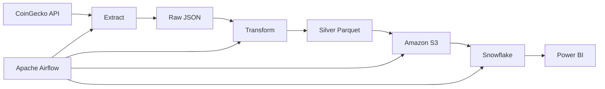

<div align="center">

# 🚀 Crypto Market ETL Pipeline

### A Production-Ready Cloud Data Engineering Pipeline

[](https://www.python.org/)
[](https://airflow.apache.org/)
[](https://www.docker.com/)
[](https://aws.amazon.com/s3/)
[](https://www.snowflake.com/)
[](https://pandas.pydata.org/)
[](LICENSE)

Extract • Validate • Transform • Load • Orchestrate • Analyze

</div>

---

# 📖 Overview

This project demonstrates the implementation of a modern **cloud-native ETL pipeline** that ingests live cryptocurrency market data from the **CoinGecko API**, transforms it into analytics-ready datasets, stores it in **Amazon S3**, loads it into **Snowflake**, and orchestrates the entire workflow using **Apache Airflow**.

The goal is to showcase production-level Data Engineering practices including:

- API ingestion
- Schema enforcement
- Data validation
- Metadata management
- Hive partitioning
- Cloud storage
- Workflow orchestration
- Data warehousing
- Business Intelligence

---

# 🎯 Project Objectives

- Build an end-to-end ETL pipeline
- Implement Medallion Architecture
- Store data in a cloud data lake
- Automate workflows with Airflow
- Load data into Snowflake
- Build executive dashboards in Power BI
- Demonstrate production-ready engineering practices

---

# 🏛 Architecture



---

# 🏗 Data Architecture

```
                 Bronze Layer
          Raw JSON from API

                    │

                    ▼

                Silver Layer
      Cleaned & Validated Parquet

                    │

                    ▼

                 Gold Layer
        Snowflake Analytical Tables

                    │

                    ▼

            Power BI Dashboard
```

---

# ⚙ Technology Stack

| Layer | Technology |
|---------|------------|
| Language | Python |
| Processing | Pandas |
| API | CoinGecko |
| Cloud Storage | Amazon S3 |
| Data Warehouse | Snowflake |
| Orchestration | Apache Airflow |
| Containerization | Docker |
| Database | PostgreSQL |
| File Format | JSON / Parquet |
| Cloud SDK | boto3 |

---

# 📂 Project Structure

```text
crypto-market-etl-pipeline/
│
├── config/
├── dags/
├── data/
│   ├── raw/
│   ├── processed/
│   └── archive/
│
├── logs/
├── plugins/
├── scripts/
├── sql/
│
├── Dockerfile
├── docker-compose.yml
├── requirements.txt
├── README.md
└── .env
```

---

# 🔄 Pipeline Workflow

```text
CoinGecko API

      │

      ▼

Extract

      │

      ▼

Validate

      │

      ▼

Transform

      │

      ▼

Parquet

      │

      ▼

Amazon S3

      │

      ▼

Snowflake

      │

      ▼

Power BI
```

---

# 📊 Features

✅ Live API ingestion

✅ Automatic retries

✅ Metadata generation

✅ Batch tracking

✅ UUID batch IDs

✅ Schema enforcement

✅ Data validation

✅ Hive partitioning

✅ Parquet conversion

✅ Amazon S3 upload

✅ Apache Airflow orchestration

⬜ Snowflake loading

⬜ Power BI dashboard

⬜ GitHub Actions CI/CD

⬜ Unit tests

⬜ Great Expectations

---

# 📁 Hive Partitioning

```
data/

raw/

year=2026/

    month=07/

        day=12/

processed/

year=2026/

    month=07/

        day=12/
```

---

# 🚀 Quick Start

## Clone Repository

```bash
git clone https://github.com/Sanusi-Abdulmalik/crypto-market-etl-pipeline.git
```

## Create Virtual Environment

```bash
python -m venv .venv
```

Activate

Windows

```bash
.venv\Scripts\activate
```

Linux

```bash
source .venv/bin/activate
```

---

## Install Dependencies

```bash
pip install -r requirements.txt
```

---

## Configure AWS

```bash
aws configure
```

---

## Start Airflow

```bash
docker compose up -d --build
```

---

## Run ETL

```bash
python -m scripts.extract

python -m scripts.transform

python -m scripts.load_to_s3
```

---

# 📈 Project Roadmap

| Status | Task |
|---------|------|
| ✅ | Project setup |
| ✅ | CoinGecko API integration |
| ✅ | Raw data ingestion |
| ✅ | Metadata generation |
| ✅ | Validation framework |
| ✅ | Parquet conversion |
| ✅ | Amazon S3 upload |
| 🚧 | Airflow orchestration |
| ⏳ | Snowflake loading |
| ⏳ | SQL transformations |
| ⏳ | Power BI dashboard |
| ⏳ | GitHub Actions |
| ⏳ | Terraform deployment |

---

# 📸 Screenshots

### Airflow DAG

*(Coming soon)*

---

### Amazon S3

*(Coming soon)*

---

### Snowflake

*(Coming soon)*

---

### Power BI Dashboard

*(Coming soon)*

---

# 💡 Business Value

This project demonstrates how financial market data can be transformed into a scalable analytics platform that supports:

- Cryptocurrency market monitoring
- Executive reporting
- Trend analysis
- Portfolio tracking
- Historical analytics
- Data warehousing
- Cloud-native ETL pipelines

---

# 👤 Author

**Abdulmalik Sanusi**

Data Engineer | Data Analyst

- GitHub: https://github.com/Sanusi-Abdulmalik
- LinkedIn: https://www.linkedin.com/in/abdulmalik-sanusi-b3a0813a3

---

# ⭐ If you found this project useful, consider giving it a star!