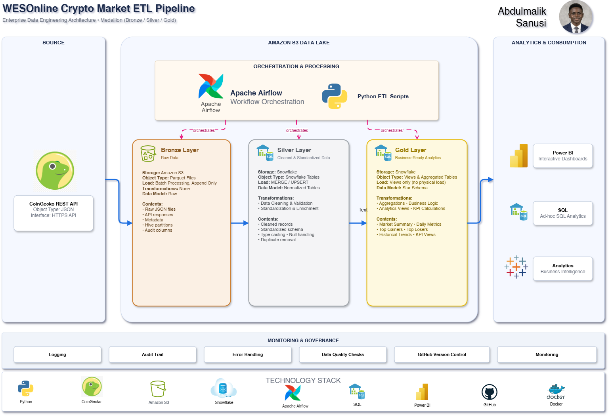
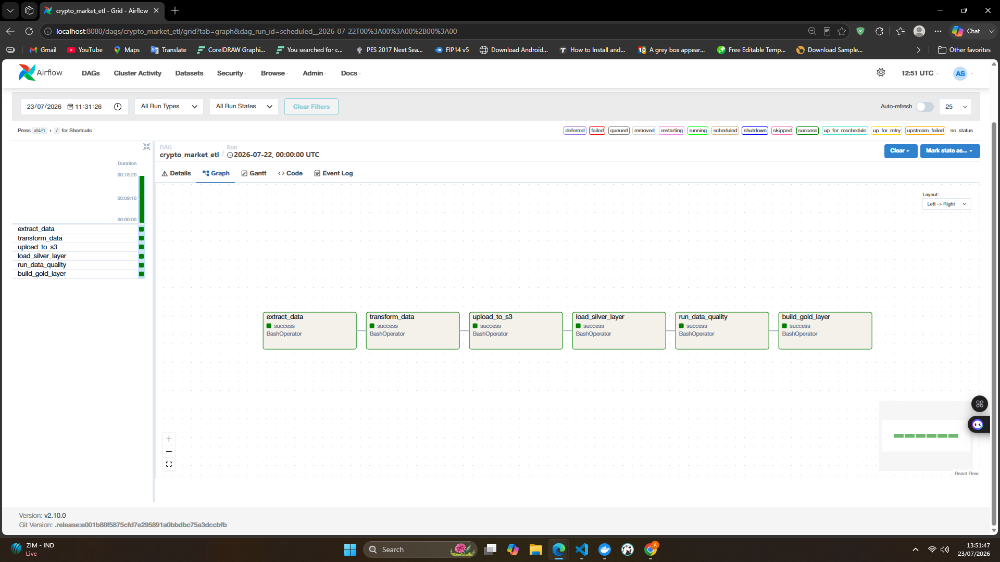
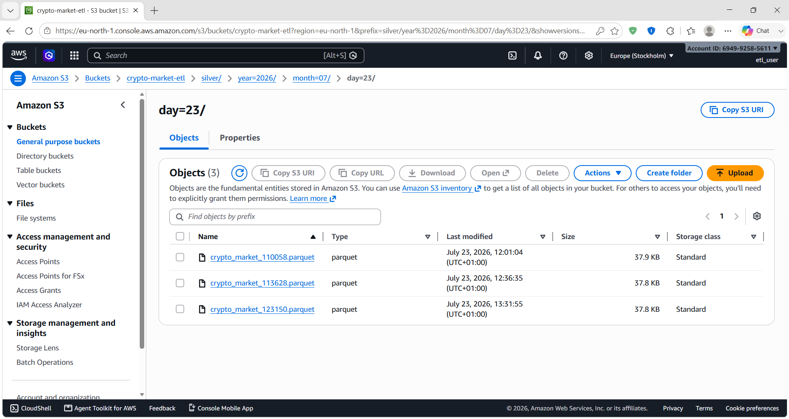
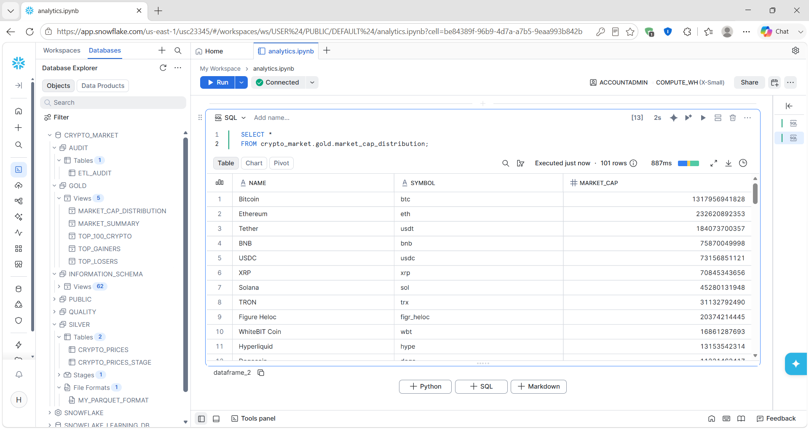
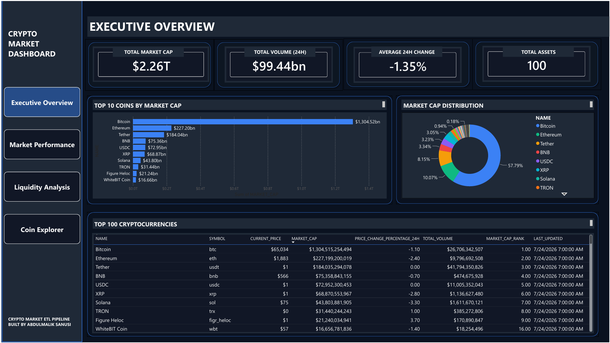

<div align="center">

# 🚀 Crypto Market ETL Pipeline
An end-to-end cloud-based Data Engineering project that ingests live cryptocurrency market data from the CoinGecko API, transforms it into analytics-ready datasets, stores it in Amazon S3, loads it into Snowflake, and orchestrates the entire workflow using Apache Airflow.


Extract • Validate • Transform • Load • Orchestrate • Analyze

</div>

---
# 📖 Overview

The **Crypto Market ETL Pipeline** is a production-inspired Data Engineering project that automates the ingestion, transformation, validation, storage, and orchestration of live cryptocurrency market data.

This project is being built as part of the **WesOnline Data Engineering Mentorship Program** to demonstrate modern data engineering practices and production-ready ETL pipeline development.

The pipeline retrieves real-time market data from the CoinGecko API, validates and transforms it into analytics-ready Parquet datasets, stores it in Amazon S3, and prepares it for downstream analytics in Snowflake and Power BI.

The project demonstrates modern cloud data engineering practices including:

- REST API ingestion
- Data validation
- Schema enforcement
- Metadata management
- Hive-style partitioning
- Cloud Data Lake architecture
- Workflow orchestration
- Data warehousing
- Business Intelligence

---

# 🎯 Objectives

The primary objectives of this project are to:

- Build an end-to-end ETL pipeline
- Demonstrate production-ready Data Engineering practices
- Implement a Medallion Architecture
- Store data in a cloud data lake
- Orchestrate workflows using Apache Airflow
- Load curated datasets into Snowflake
- Develop an executive dashboard in Power BI

---

# 🏛 Solution Architecture



---

# ⚙ Tech Stack

| Category | Technology |
|-----------|------------|
| Language | Python 3.12 |
| Orchestration | Apache Airflow |
| Data Warehouse | Snowflake |
| Data Lake | Amazon S3 |
| Containerization | Docker |
| Data Processing | Pandas |
| API | CoinGecko API |
| SQL | Snowflake SQL |
| Storage Format | JSON, Parquet |
| Version Control | Git & GitHub |

---

## 📌 Roadmap

- [x] Extract cryptocurrency data
- [x] Transform and validate datasets
- [x] Generate Parquet files
- [x] Upload to Amazon S3
- [x] Integrate Snowflake
- [x] Build Airflow pipeline
- [x] Gold analytics layer
- [x] Power BI dashboards
---

# 📸 Screenshots

## Airflow DAG
The complete ETL workflow is orchestrated using Apache Airflow.



## Amazon S3 Bucket
Cryptocurrency market data is stored in Amazon S3 using Hive-style partitioning.



## Snowflake Table
The Gold layer contains analytics-ready datasets used for reporting and visualization.

Example metrics include:

- Current Price
- Market Capitalization
- Market Cap Rank
- 24 Hour Price Change
- Trading Volume
- Circulating Supply



## Power BI Dashboard

---


# 🚀 Quick Start

## Clone Repository

```bash
git clone https://github.com/Sanusi-Abdulmalik/crypto-market-etl-pipeline.git
cd crypto-market-etl-pipeline
```

---

## Start Airflow

```bash
docker compose up -d --build
```
---

## Trigger Pipeline

Open Airflow

```
http://localhost:8080
```

Enable the DAG and trigger a run.

---

# 📈 Future Enhancements

- Power BI dashboard
- Slack notifications

---

# 💼 Skills Demonstrated

This project showcases practical experience in:

- Data Engineering
- ETL Pipeline Development
- Cloud Computing
- Amazon Web Services
- Apache Airflow
- Docker
- Python
- Pandas
- Snowflake
- Data Validation
- Metadata Management
- Data Lake Design
- Workflow Automation

---

# 🙏 Acknowledgements

This project is being developed as part of the **WesOnline Data Engineering Mentorship Program**, with a focus on building production-ready cloud data engineering solutions using modern industry tools and best practices.

---

# 👤 Author

**Abdulmalik Sanusi**

Data Engineer | Data Analyst

GitHub: https://github.com/Sanusi-Abdulmalik

LinkedIn: https://www.linkedin.com/in/abdulmalik-sanusi-b3a0813a3

---

<div align="center">

### ⭐ If you found this project useful, consider giving it a star!

</div>
